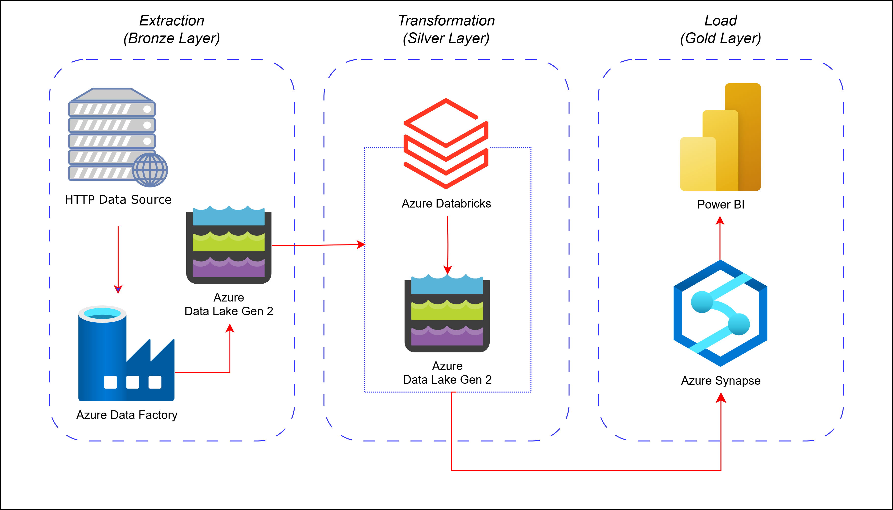

# Lakehouse Nexus: An Azure Data Journey 

Screenshots/ProjectFlows.png

### 🔍 Overview
Lakehouse Nexus is an end-to-end data pipeline built using Azure’s Medallion Architecture (Bronze, Silver, and Gold layers). This project showcases a scalable and efficient data engineering workflow that transforms raw data into meaningful insights using Azure Data Factory, Databricks, Synapse, and Power BI.

### What is a Lakehouse?  💥
A Lakehouse is a modern data management architecture that combines the best features of a data lake and a data warehouse to provide scalability, reliability, and real-time analytics in a single platform.

### But why do we need Lakehouse?  🤔
Traditional architectures had few limitations:

- **Data Lakes**  (Azure Data Lake, S3, HDFS) are great for storing raw data but lack governance, indexing, and performance for analytics.
- **Data Warehouses** (Azure Synapse, Snowflake) provide structured storage and SQL-based analytics but are expensive and less flexible for unstructured data.
The Lakehouse architecture eliminates these problems by bringing data warehousing capabilities to a data lake.

### 🚀 Benefits of a Lakehouse
✔️ **Lower Costs** – Uses super cheap storage but supports analytics.\
✔️ **Scalability** – Handles large volumes of structured & unstructured data. \
✔️ **Flexibility** – Supports both batch and real-time processing. \
✔️ **Better Governance** – Schema enforcement & ACID compliance. \
✔️ **Simplified Architecture** – Reduces the need for multiple systems.

### Architecture Overview 🏗️
- **Bronze Layer (Raw Data Ingestion)**:
  Data is collected from an HTTP API using Azure Data Factory (ADF) stored in Azure Data Lake Gen2 as raw data.
  
- **Silver Layer (Data Transformation)**:
  Azure Databricks processes and cleans the raw data. Transformations include data filtering, deduplication, and normalization. Refined data is stored back into Azure Data Lake Gen2.
  
- **Gold Layer (Data Serving & Analytics)**:
  Azure Synapse pulls transformed data from Data Lake and creates serving tables using SQL. Data is optimized for reporting and business insights.
  
- **Reporting & Visualization**:
  Power BI connects to Synapse to generate interactive dashboards.
### Technology Stack 🛠️
✅ **Azure Data Factory** – Data ingestion from HTTP API. \
✅ **Azure Data Lake Gen2** – Storage for raw and transformed data.   
✅ **Azure Databricks** – Data transformation and processing.\
✅ **Azure Synapse Analytics** – Data warehouse and serving layer.\
✅ **Power BI** – Visualization and reporting.\
✅ **SQL** – Data transformation in the Gold layer.

### 🎯 Summary !
Lakehouse Nexus project is an example of modern and cloud-native data pipeline that supports the Lakehouse principles, combining data lake flexibility with warehouse performance to create a scalable, efficient data engineering solution. 
